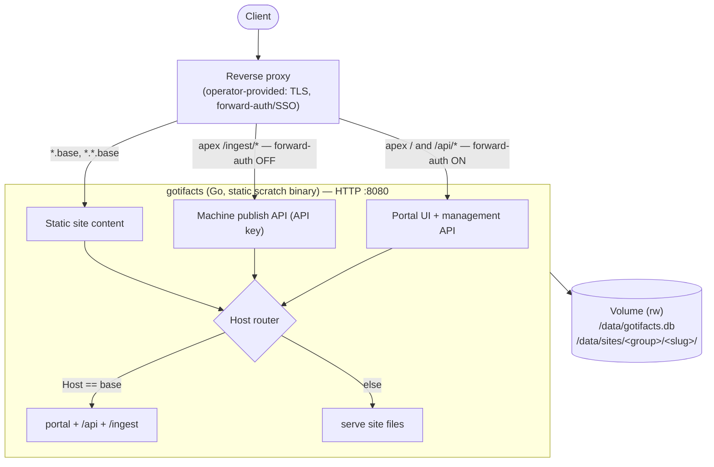

<p align="center">
  
</p>

<p align="center">
    A single, self-hosted <b>Go</b> service that <b>hosts static sites</b> by host-based routing and serves a <b>dynamic portal</b> to browse them.
</p>

<p align="center">
  <a href="https://github.com/lmgarret/gotifacts/actions/workflows/ci.yml"></a>
  <a href="LICENSE"></a>
  <a href="https://goreportcard.com/report/github.com/lmgarret/gotifacts"></a>
</p>

---

You publish sites over an HTTP API; gotifacts stores them on a volume with a 
**SQLite** registry and serves them at `https://<slug>.<group>.<base>`.

gotifacts runs behind **any** reverse proxy you provide (nginx, Caddy, …) for
TLS and SSO/forward-auth. It serves plain HTTP on one port, never TLS, and
enforces its own authorization.

- **One static binary** (CGO-free, built `FROM scratch`).
- **SQLite + a volume** are the only state.
- **No hardcoded domains/hosts/paths** — everything is configurable.

## 📖 Documentation

**Full documentation lives at → https://lmgarret.github.io/gotifacts**

It's organized by the [Diátaxis](https://diataxis.fr/) framework:

- **Tutorials** — [run gotifacts locally](https://lmgarret.github.io/gotifacts/tutorials/run-locally/)
  and [publish your first site](https://lmgarret.github.io/gotifacts/tutorials/publish-first-site/).
- **How-to guides** — [Docker](https://lmgarret.github.io/gotifacts/guides/deploy-with-docker/),
  [nginx](https://lmgarret.github.io/gotifacts/guides/reverse-proxy-nginx/) /
  [Caddy](https://lmgarret.github.io/gotifacts/guides/reverse-proxy-caddy/),
  [API keys](https://lmgarret.github.io/gotifacts/guides/create-api-keys/),
  [publishing from CI](https://lmgarret.github.io/gotifacts/guides/publish-from-ci/),
  [Claude via MCP](https://lmgarret.github.io/gotifacts/guides/connect-claude-mcp/).
- **Reference** — [configuration](https://lmgarret.github.io/gotifacts/reference/configuration/),
  the [HTTP API](https://lmgarret.github.io/gotifacts/reference/api/), the
  [CLI](https://lmgarret.github.io/gotifacts/reference/cli/).
- **Explanation** — [architecture](https://lmgarret.github.io/gotifacts/explanation/architecture/),
  the [two-plane auth model](https://lmgarret.github.io/gotifacts/explanation/auth-model/),
  the [threat model](https://lmgarret.github.io/gotifacts/explanation/security/).

## How it works



The service routes purely by the request `Host`: the apex host serves the portal
and the `/api/*` + `/ingest/*` APIs; any other host maps to a site directory and
serves static files.

## Quickstart (Docker)

A proxy-agnostic [`docker-compose.yml`](docker-compose.yml) is provided; the
image is published to `ghcr.io/lmgarret/gotifacts`.

```sh
cp .env.example .env
# edit .env: set GOTIFACTS_BASE_DOMAIN, GOTIFACTS_ADMIN_USERS, GOTIFACTS_TRUSTED_PROXIES
docker compose up -d
```

gotifacts is reachable only on the internal network — **never expose port 8080
to the internet.** Put your reverse proxy in front of it for TLS and
forward-auth. See the
[Docker](https://lmgarret.github.io/gotifacts/guides/deploy-with-docker/) and
reverse-proxy guides for the full setup, and
[`examples/`](examples/) for reference nginx/Caddy configs.

## Contributing & security

- Development setup and the docs workflow: [`CONTRIBUTING.md`](CONTRIBUTING.md)
  and [`AGENTS.md`](AGENTS.md).
- Threat model and private vulnerability reporting: [`SECURITY.md`](SECURITY.md).

```sh
go test -race ./...          # backend tests
golangci-lint run ./...      # backend lint
cd web && npm ci && npm run lint && npm run build   # frontend
```

The Go module path is `github.com/lmgarret/gotifacts`; `go.mod` is the single
source of truth for the Go version.

## License

[MIT](LICENSE).
